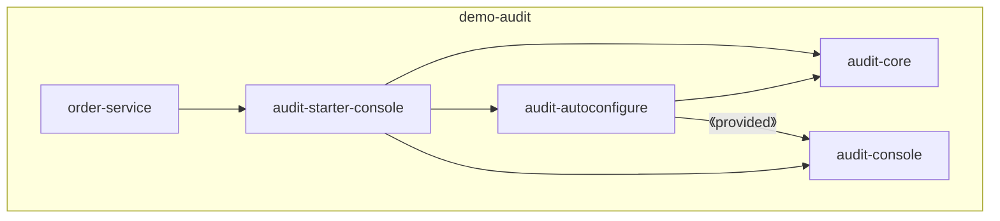

# Spring Boot Auto-configuration 세미나 예제 프로젝트

Spring Boot의 **Auto-configuration**과 **Custom Starter** 패턴에 대한 세미나 데모 프로젝트입니다.

REST 컨트롤러 호출을 자동으로 감사(Audit) 로깅하는 라이브러리를 직접 만들어 보며, Spring Boot가 어떻게 의존성만 추가해도 기능이 자동으로 활성화되는지 그 원리를 보여줍니다.

---

## 핵심 학습 개념

| 개념                         | 설명                                                                                      |
|----------------------------|-----------------------------------------------------------------------------------------|
| `@AutoConfiguration`       | 스프링 부트가 클래스패스를 스캔해 자동으로 빈을 등록하는 메커니즘                                                    |
| `@ConditionalOn*`          | 조건부 빈 등록 (`@ConditionalOnClass`, `@ConditionalOnMissingBean`, `@ConditionalOnProperty`) |
| `@ConfigurationProperties` | `application.yml` 값을 타입 안전하게 바인딩                                                        |
| Custom Starter             | `autoconfigure` + 구현 모듈을 묶어 의존성 하나로 기능 전체를 제공하는 패턴                                      |
| AOP (`@Aspect`)            | `@RestController` 가 붙은 모든 메서드 호출을 횡단 관심사로 가로채 감사 로그 기록                                  |

---

## 모듈 구조

```
demo-audit/
├── audit-core              # 핵심 추상화 (AuditEvent, AuditSink, AuditLogger, AOP Aspect)
├── audit-autoconfigure     # Auto-configuration 정의
├── audit-console           # 콘솔 출력 구현체 (System.out / Logger)
├── audit-dbms              # DB 저장 구현체 (Spring Data JPA)
├── audit-starter-console   # 콘솔용 스타터 (의존성 묶음)
├── audit-starter-dbms      # DB용 스타터 (의존성 묶음)
└── order-service           # 스타터를 실제로 사용하는 예제 서비스
```

### 모듈 의존 관계

```
order-service
  └── audit-starter-console (또는 audit-starter-dbms)
        ├── audit-core
        ├── audit-autoconfigure
        └── audit-console (또는 audit-dbms)
```



---

## 핵심 컴포넌트

### `AuditSink` — 감사 이벤트 출력 인터페이스

```java
public interface AuditSink {
    void send(AuditEvent event);
}
```

구현체는 세 가지입니다.

| 구현체                 | 동작                     | 활성화 조건                               |
|---------------------|------------------------|--------------------------------------|
| `LoggerAuditSink`   | SLF4J 로거로 출력           | `audit-starter-console` 의존성 추가 + 기본값 |
| `ConsoleAuditSink`  | `System.out`으로 출력      | `demo.audit.console-type=system_out` |
| `DatabaseAuditSink` | `audit_events` 테이블에 저장 | `audit-starter-dbms` 의존성 추가          |
| `NoOpAuditSink`     | 아무것도 하지 않음             | 스타터가 없을 때 폴백                         |

### `ControllerAuditAspect` — AOP 자동 감사 로깅

`@RestController`가 붙은 모든 클래스의 메서드 호출을 가로채 실행 시간과 함께 자동으로 감사 로그를 남깁니다.

```java
@Around("@within(org.springframework.web.bind.annotation.RestController)")
public Object auditControllerCall(ProceedingJoinPoint joinPoint) throws Throwable { ... }
```

### `AuditAutoConfiguration` — 조건부 자동 설정

클래스패스에 어떤 구현체가 있는지에 따라 적절한 `AuditSink` 빈을 자동으로 선택합니다.

```
클래스패스에 DatabaseAuditSink 있음  →  DatabaseAuditSink 등록
클래스패스에 ConsoleAuditSink 있음   →  LoggerAuditSink 또는 ConsoleAuditSink 등록
둘 다 없음                           →  NoOpAuditSink 등록 (경고 로그 출력)
```

---

## 설정 옵션 (`application.yml`)

```yaml
demo:
  audit:
    enabled: true                  # 감사 로깅 활성화 여부 (기본값: true)
    application-name: my-service   # 감사 로그에 표시될 서비스 이름 (기본값: unknown-service)
    console-type: logger           # logger(기본값) 또는 system_out
```

---

## 스타터 전환 방법

`order-service/pom.xml`의 의존성을 바꾸는 것만으로 감사 저장 방식이 전환됩니다.

**콘솔 출력 (기본)**
```xml
<dependency>
    <groupId>com.github.switchover.example</groupId>
    <artifactId>audit-starter-console</artifactId>
    <version>0.1.0-SNAPSHOT</version>
</dependency>
```

**DB 저장으로 전환**
```xml
<dependency>
    <groupId>com.github.switchover.example</groupId>
    <artifactId>audit-starter-dbms</artifactId>
    <version>0.1.0-SNAPSHOT</version>
</dependency>
```

---

## 실행 방법

### 사전 요구사항

- Java 21
- Maven 3.x

### 빌드 및 실행

```bash
# 전체 멀티모듈 빌드
mvn install

# order-service 실행
cd order-service
mvn spring-boot:run
```

### API 호출 테스트

```bash
GET http://localhost:8080/orders/1
```

호출하면 감사 로그가 설정된 방식(콘솔 또는 DB)으로 기록됩니다.

---

## 기술 스택

- **Spring Boot** 3.5.6
- **Java** 21
- **Spring AOP** — 컨트롤러 감사 횡단 관심사
- **Spring Data JPA** — DB 저장 구현체
- **H2** — 인메모리 DB (order-service 예제용)
- **Lombok** — 보일러플레이트 코드 제거
